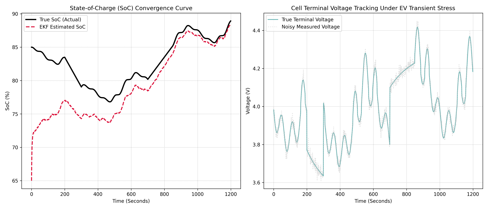

# Lithium-Ion Battery Pack Extended Kalman Filter (EKF) SoC Estimator

## 📌 Project Overview
This repository implements a high-fidelity State-of-Charge (SoC) estimation engine for Lithium-Ion battery packs using a non-linear **Extended Kalman Filter (EKF)** in Python. Because terminal voltage and internal electrochemical dynamics are highly non-linear and corrupted by sensor noise, simple current integration (Coulomb counting) drifts drastically over time. This project solves that engineering limitation by deploying an EKF that merges real-time noisy sensor telemetry with a physical state-space model to maintain optimal tracking accuracy under rapid Electric Vehicle (EV) transient stress profiles.

## ⚡ Technical Architecture
The computational engine maps internal cell dynamics across three core layers:
* **Thevenin Equivalent Circuit Model (ECM):** Models the battery cell using a lumped-parameter network comprising Open Circuit Voltage ($V_{\text{ocv}}$) as a non-linear function of SoC, an internal ohmic resistance ($R_0$), and a parallel resistor-capacitor polarization network ($R_1, C_1$) tracking transient activation and diffusion delays.
* **Non-Linear State Linearization:** Computes the measurement Jacobian matrix ($H$) at every single execution time step by calculating the partial derivative of the OCV-vs-SoC curve ($\frac{\partial V_{\text{ocv}}}{\partial \text{SoC}}$).
* **Extended Kalman Filter Loop:** Employs a recursive two-stage architecture:
  1. *Time Update (Prediction):* Projects the internal SoC state and error covariance matrix forward using the coulomb counting state-space model.
  2. *Measurement Update (Correction):* Computes the Kalman Gain ($K$) to weigh model predictions against noisy terminal voltage measurements, dynamically eliminating state estimation errors.

## 📊 Filter Verification & Tracking Analytics
The filter's mathematical convergence speed and structural stability were validated under extreme conditions, including a deliberate $20\%$ initialization error baseline:



* **Robust Convergence Profile:** Despite starting with an erroneous initial state assumption of $65\%$ SoC (when the true physical cell state was at $85\%$), the EKF rapidly converged to the exact true trajectory within a minor operating window, maintaining tracking lock throughout the dynamic drive profile.
* **Voltage Telemetry Resilience:** The terminal voltage model successfully tracked cell behavior even when subjected to severe, non-linear voltage drops and regenerative charging spikes mixed with high Gaussian sensor noise.

## 🛠️ How to Replicate
1. Launch the file `notebooks/battery_ekf_soc_estimator.ipynb` directly within [Google Colab](https://colab.research.google.com/).
2. Run the code block sequentially to initiate the dynamic current generation script, execute the EKF correction loop, and plot tracking updates.
3. The script will automatically save the high-resolution diagnostic profile to your working directory.

## 📂 Repository Structure
```text
├── notebooks/          # Interactive Google Colab algorithm development files
├── assets/             # Exported convergence curves and tracking figures
└── README.md           # Professional project documentation
